# **🔐 Cryptographic Attacks – Cracking Weak Password Hashes & Exploiting Poor Authentication in Databases 🗝️💻**


<br/>

---

## **Objectives** 🎯

1. Identify and exploit cryptographic weaknesses in database authentication.
2. Perform offline hash cracking on discovered password hashes.
3. Investigate real-world cryptographic failures.
4. Propose secure cryptographic solutions.

 <br/>

---

## **Ingredients Needed** 🧰

| Tool        | Use                               |
| ----------- | --------------------------------- |
| `OpenSSL`   | Check supported SSL/TLS           |
| `nmap`      | Port scanning & service detection |
| `nc`        | Quick port scan                   |
| `MySQL`     | Access and enumeration            |
| `hashid`    | Identify hash types               |
| `john`      | Cracking password hashes          |
| `hashcat`   | GPU-based hash cracking           |
| `Wireshark` | Network traffic analysis          |

---

<br/>

## **Lab Setup** 🖥️⚙️

- **Attacker Machine**: **Kali Linux** 🐍
- **Target**: Vulnerable machine running an exposed database service 🧱

<br/>

---

## Checkpoints 🚩

- [Task 1: Service Enumeration and Initial Access 🔍](#task-1-service-enumeration-and-initial-access-)
- [Task 2: Enumeration of Users and Authentication Weakness 💎](#task-2-enumeration-of-users-and-authentication-weakness-)
- [Task 3: Password Hash Discovery and Hash Identification 🔑](#task-3-password-hash-discovery-and-hash-identification-)
- [Task 4: Offline Hash Cracking 🔓](#task-4-offline-hash-cracking-)
- [Task 5: Cryptographic Analysis and Mitigation 🧩](#task-5-cryptographic-analysis-and-mitigation-)
- [Task 6: Wireshark Analysis 🦈](#task-6-wireshark-analysis-)

---
---

## **Task 1: Service Enumeration and Initial Access** 🔍

### ✅ 1.1 Finding the Target IP 🛰️

- Using `Netdiscover`

```bash
netdiscover
```

- Scans your local subnet for live devices.
- Helps you find IPs and MAC addresses </br> </br> </br>

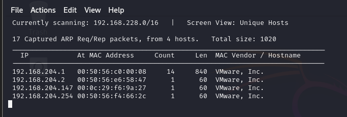

<br>

---

- Using `Nmap`

```bash
nmap -sS -sV -p- <Target IP>
```

- `-sS`: SYN scan (stealthy)
- `-sV`: Service version detection
- `-p-`: Scan all 65535 TCP ports

⚠️ Since this command run Scans on **all ports** it will require a long time to finish

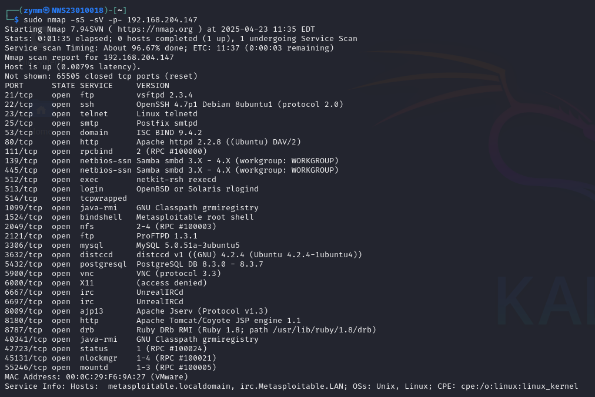

<br>

---

So instead we shortlist the ports that are commonly used or just the one we want

```sh
sudo nmap -sS -sV -p 21,22,23,25,80,111,139,445,512-515,3306,5432,5900,6000 192.168.204.147
```

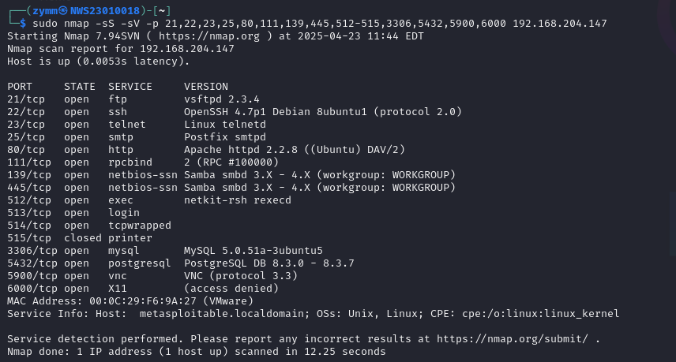

Discovered port **3306** open → MySQL service detected.

 <br/>

---

#### Alternative

```bash
nc -zv <Target IP> <ports>
```

- `-z`: Scan without sending data
- `-v`: Verbose output

Not stealthy (full TCP handshake), better for basic connectivity check.

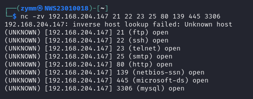

<br/>

---

### ✅ 1.2 OpenSSL Check for Encryption 🔑

```bash
openssl s_client -connect <target IP>:3306 -quiet
```

- `openssl` : The OpenSSL command-line tool for cryptographic operations
- `s_client` : A subcommand used to act as an SSL/TLS client and connect to a remote server
- `-connect <target IP>:3306` : Specifies the target IP and port to test (here, port 3306 for MySQL).

---

#### Optional

- `-quiet` : Suppresses verbose output (e.g., certificate details), showing only critical errors or success messages.

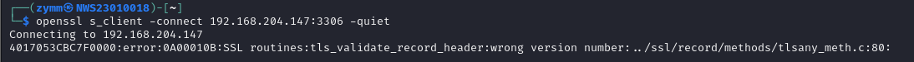

 <br/>

---

### Results 📊

It tests whether the target service (e.g., MySQL) supports SSL/TLS encryption on port 3306.

- If SSL/TLS is **enabled and configured**, you’ll see a **successful SSL handshake** and _certificate details_.

- If SSL/TLS is **not supported**, you’ll get an **error** (e.g., no peer certificate available or SSL3_GET_RECORD: wrong version number).

 <br/>

---

### ✅ 1.3 Connection Attempt 🔌

```bash
MySQL -h <Target IP> -u root
```

Running this command will attempt a connection to the MySQL service

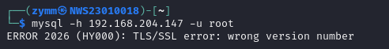

<br>

---

### **⚠️ Problem Encountered ⚠️** 😖

- Running this command will result in error

  **`ERROR 2026 (HY000): TLS/SSL error: wrong version number`**

- This is due to the mismatch in SSL/TLS versions / Or this may happen if the service doesn't support the usage of SSL/TLS

<br>

---

### ✅ **Solution** ✅ 🛠️

But we can bypass/fix this by adding this at the end of the command

- `--ssl=0`

  OR

- `--ssl-mode=DISABLED`

<br>

Running this command will result in a success connection to MySQL

```sh
MySQL -h 192.168.204.147 -u root --ssl=0
```

OR

```sh
MySQL -h 192.168.204.147 -u root --ssl=DISABLED
```

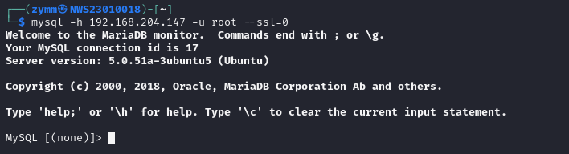

💥We have successfully entered the **Database** of **MySQL** service 💥

---

<br/> <br>

---
---

## Task 2: Enumeration of Users and Authentication Weakness 🔎

---

### ✅ Enumeration

1. Enter MySQL database ⬇️

```sql
USE MySQL
```

2. Lets see what MySQL contents ⬇️

```sql
SHOW TABLES;
```

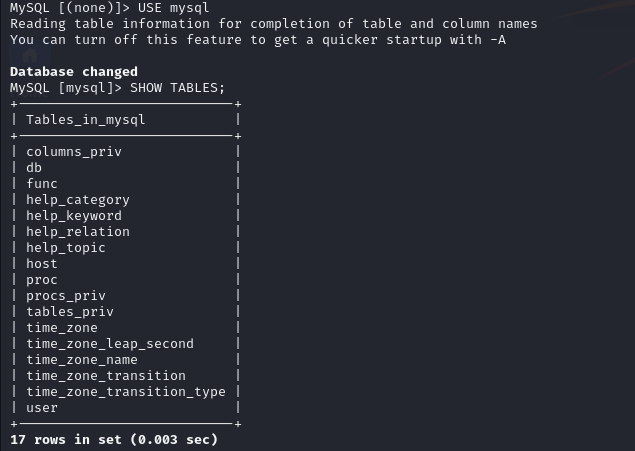

3. Find the required info ⬇️

```sql
SELECT host, user, password FROM user;
```

OR

To direcly show the required info from MySQL **user** table ⬇️

```sql
SELECT * FROM MySQL.user;
```

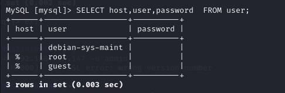

 <br/>

---

### 🔴 Result 🔴 🟥

After obtainin the oh sweet data from MySQL database, you can see that the **users** don't have any **password configured**, allowing anyone to gain access to the database, which is worsen by the fact that it can be entered by **any hosts**

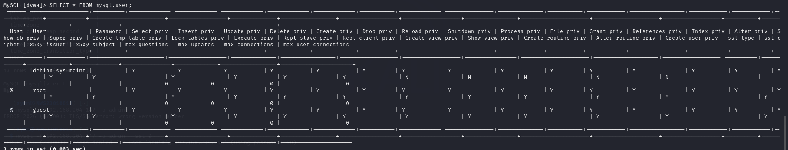

 <br/>

---

### **TLDR**

- Empty space in `Password` column means no password configured
- `%` symbol mean that it can be entered from any IPs
- Every privilage column is labeled `Y` or Yes means that all data can be modified

 <br/>

---

### ⭐ ❔Question: Is no password a cryptographic failure? ❔ ⭐ 🤔

**Yes.** It completely bypasses cryptographic authentication. A secure system must require password Hashing + proper access control.

As we also know that a database where a crucial/confidential data, can be access without any password/authentication, would be breaching the CIA triad:

- C: Confidentiality : The data stored would no longer be a secret
- I: Intergrity : The data can be changed
- A: Authentication : No password to access the database

---

<br/> <br>

---
---

## Task 3: Password Hash Discovery and Hash Identification 🔑

Now that we know MySQL don't have anypassword, lets find a Databasewhich has one, in this case **`DVWA`** or `Damn Vulnerable Web Application`

1. Enter DVWA database ⬇️

```sql
USE dvwa
```

Now that we're in the database, Lets start digging ⛏️

2. Lets see what DVWA hiding 👀 😈

```sql
SHOW TABLES;
```

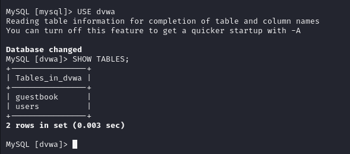

3. Find the required info ⬇️

```sql
SELECT * FROM users;
```

OR

```sql
SELECT * FROM dvwa.users;
```

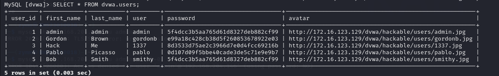

 <br/>

---

### 🔴 Results 🔴 🟥

From the picture, we can see that the users from dvwa has passwords configure unlike MySQL, but you don't understand it, do you?

This is because the password is encrypted, unabling us from seeing the real password

Now that you understands, lets move on

 <br/>

---

### ✅ 3.1 Extract the Hash 🗂️

Lets choose Bob/Smithy as our target, why? Cause I feel like doing so 🤣

The extracted hash from Bob:


```text
5f4dcc3b5aa765d61d8327deb882cf99
```

 <br/>

---

### ✅ 3.2 Identify the Hash

We can use:

- `hashid`
- `hash-identifier`

### Using `hashid` ⬇

```sh
hashid '5f4dcc3b5aa765d61d8327deb882cf99'
```


🎈 We can see that it show many posibilities of hash, so we need to check the characteristic of the hash we extracted

- 32 characters
- Digits 0–9 and lowercase letters a–f only (hexadecimal)
- It is just the 32‑char string—no \*, no $, no colons
- Typically lowercase (uppercase works too, but apps usually store lowercase)

### Using `hash-identifier` 

1. Startup `Hash-Identifier` ⬇️
2. Enter the `hash` that you want to crack ⬇️

```sh
hash-identifer
```

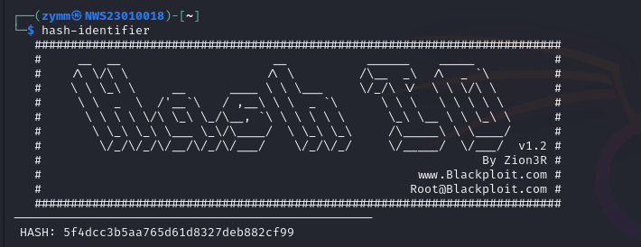

3. Press enter and it will identify which hash was used ⬇️

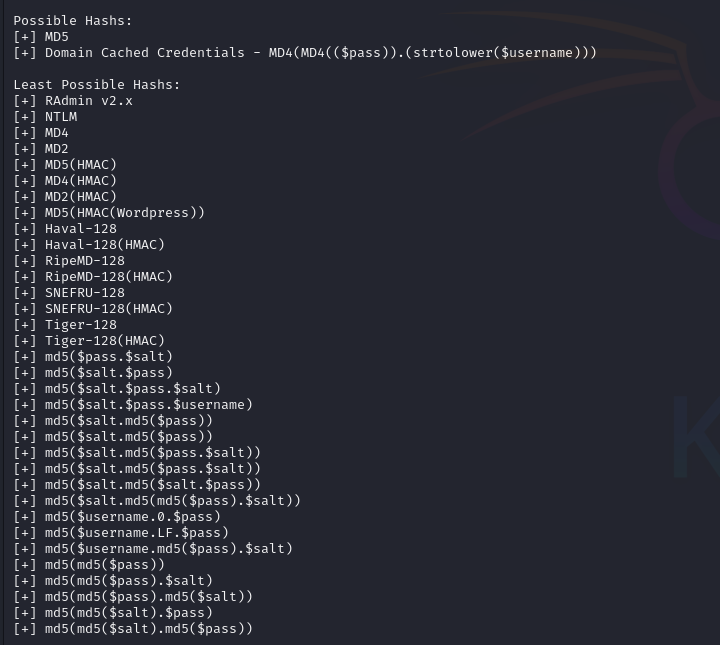

🟩 The results shows that the most possible hash used was eaither MD5 or MD4

 <br/>

---

### Rule of thumb 👍

| Characteristic                              | Hash                                  |
| ------------------------------------------- | ------------------------------------- |
| 32‑char hex hash from an old PHP/MySQL app? | → assume MD5.                         |
| Starts with and 40 hex chars?            | → MySQL 4.1+ SHA‑1 (94BDCE...).     |
| Starts with $1$, $6$, etc.?                 | → Linux shadow hashes (MD5, SHA‑512). |
| Upper‑case 32‑char hex split by :?          | → LM/NTLM.                            |

 <br/>

---

- Result: **MD5 Crypt**

---

### ⭐ Question: What cryptographic weaknesses exist in this hashing method? ⭐

- Fast to compute: Makes it vulnerable to brute-force and dictionary attacks.
- Outdated : MD5 has been considered broken since the mid-2000s.
- Weak Salt: Even though MD5 Crypt uses a salt, it's still not secure by modern standards.

---

<br/> <br>

---
---

## Task 4: Offline Hash Cracking 🔓

Now we arrived a the best part, craking it down

First off, save the hash to a file ⬇️

```sh
echo 5f4dcc3b5aa765d61d8327deb882cf99 > hash.txt
```

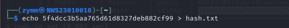

 <br/>

---

### ✅ 4.1 Using John the Ripper

```bash
john --wordlist=<wordlist> hash.txt
```

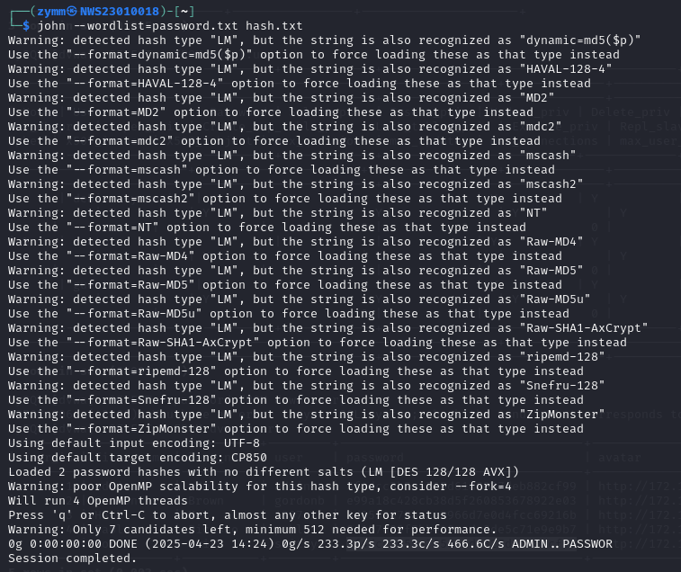

 <br/>

---

### ⚠️ Problem Encountered ⚠️

When running the code above, you will encounter the error

- `Warning: detected hash type "LM", but the string is also recognized as "dynamic=md5($p)"`

This is caused by the hash being **MD5**, and we didn't specify the format we want to use, so it wouldnt know which format to use and would **defaulted** to using **LM** format to crack it

 <br/>

---

### ✅ Solution ✅ 🛠️

This can be solved/fixed by adding the correct/wanted format to the command

- For MD5:

```sh
john --format=raw-md5 --wordlist=<wordlist> hash.txt
```

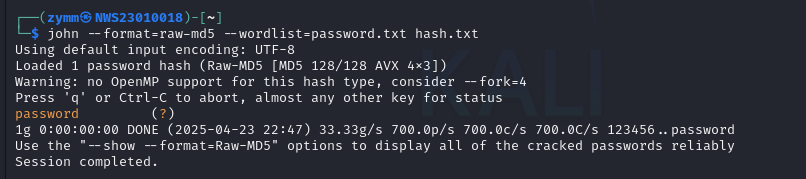

By using this command, we can see that the cracking was successful, thus showing us the treasure behind the hash

- Cracked password: `password`

 <br/>

---

### ✅ 4.2 Using Hashcat (alternative)

```bash
hashcat -m 0 -a 0 hash.txt password.txt
```

- `-m 0`: for Raw MD5 Crypt
- `-a 0`: Dictionary attack

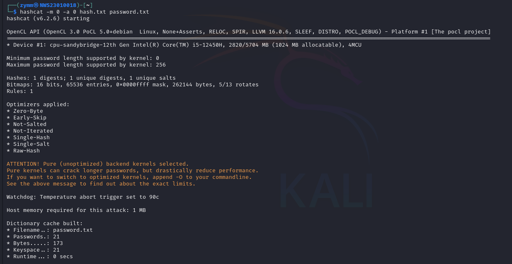
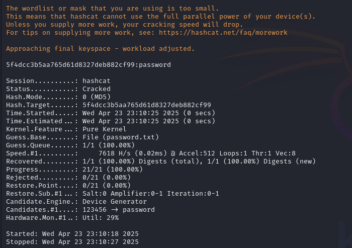

 <br/>

---

### Additional Information 📃

---

### **To view cracked hash** 🪟

John the Ripper ⬇️

- John stores the cracked hashes in the john.pot file

```sh
cat ~/.john/john.pot
```

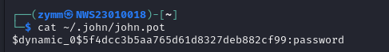

 <br/>

---

Hashcat ⬇️

- Hashcat stores cracked hashes in the hashcat.potfile

```sh
hashcat -m 0 -a 0 --show hash.txt
```

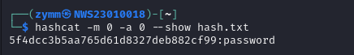

 <br/>

---

### **To clear stored cracked hash** 🗑️

John the Ripper ⬇️

- To clear the cracked hashes from the john.pot file, simply delete the john.pot file:

```sh
rm ~/.john/john.pot
```

 <br/>

---

Hashcat ⬇️

- To clear the cracked hashes from the hashcat.potfile, delete the file:

```sh
rm ~/.hashcat/hashcat.potfile
```

<br/> <br>

---
---

## Task 5: Cryptographic Analysis and Mitigation 🧩

### Issues Found 😱

- No password on some accounts
- Weak password hashes (MD5 Crypt)
- Potential plaintext transmission

### Solutions 💡

- Enforce strong password policy
- Use secure hash functions (e.g., bcrypt, Argon2)
- Enable SSL/TLS for database communication

<br/> <br>

---
---

## Task 6: Wireshark Analysis 🦈

### ✅ **6.1 Heating up the oven**

1. Fire up `Wireshark` ⬇️
2. Choose the interface that oyu want to capture ( Example: eth0 ) ⬇️
3. Add a display filter ⬇️

```bash
MySQL || tcp.port == 3306
```

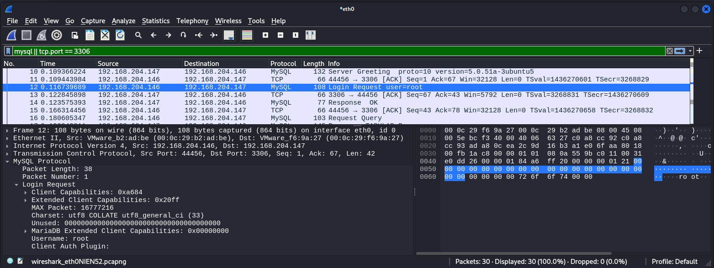

4. Start Capturing ⬇️

 <br/>

---

### ✅ **6.2 Generate Traffic**

1. Open a second terminal and log in without SSL ⬇️

```sh
MySQL -h 192.168.204.147 -u root --ssl=0
```

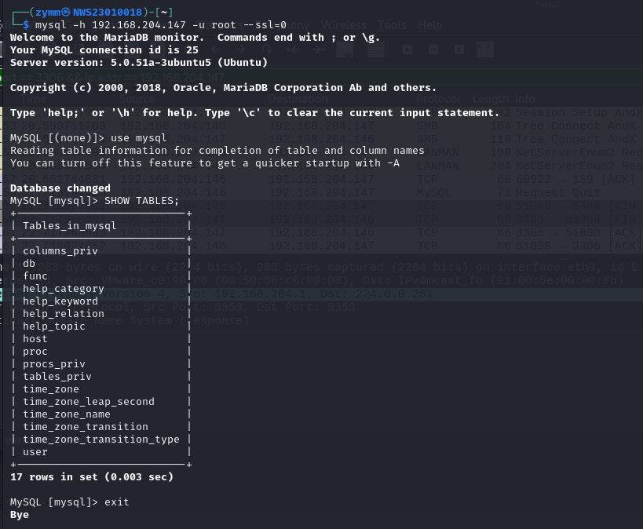

 <br/>

---

### ✅ **6.3 Stop capture & locate the login packet**

1. Look for a packet labeled “Login Request” or just the first packet from client → server after SYN/ACK ⬇️

2. Expand MySQL Protocol › Login Request. ⬇️

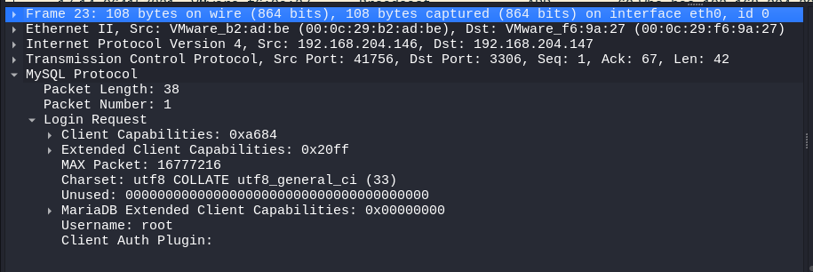

- You cann see the username: root
- Password/Client Auth Plugin: `Blank`

 <br/>

---

## Conclusion

This lab showed how poor cryptographic practices (empty passwords, weak hashes, no SSL) can easily be exploited. Stronger authentication, hashing, and encrypted communication are essential to secure systems.

---
---
