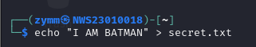
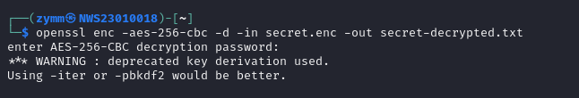
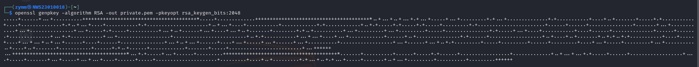
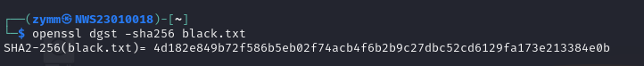
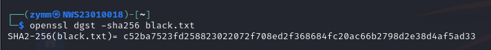
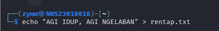
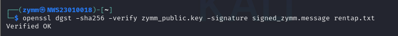
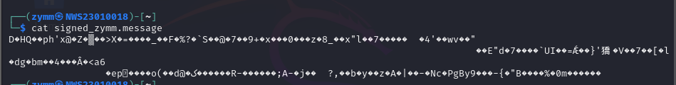
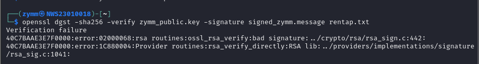

# 🔐 **Lab 3: Hands-on Exploration of Cryptographic Tools using OpenSSL**

<br>

---

## 🧰 **Lab Setup & Tools Required**

| Item               | Description                                                                                                                   |
| ------------------ | ----------------------------------------------------------------------------------------------------------------------------- |
| 🖥️ OS              | Kali Linux or any Linux distro with **OpenSSL** pre-installed                                                                 |
| 🔧 Tool            | `OpenSSL` – a toolkit for SSL/TLS and general cryptography                                                                    |
| 📂 Files           | You'll create files like `secret.txt`, `message.txt`, `black.txt`, `sign.txt`                                                 |
| ⚙️ Setting up      | ✅ Kali Linux VM or Terminal <br> ✅ Internet (for updates if needed) <br> ❌ No special services like Apache or MySQL needed |

<br>

---

## 🎯 **Objectives**

- 🔐 Perform AES (symmetric) encryption & decryption
- 🔑 Use RSA (asymmetric) encryption & decryption
- 🧮 Generate SHA-256 hashes
- ✍️ Sign and verify files using digital signatures

<br>

---
---

## 🧪 **Task 1: AES Symmetric Encryption**

### 🔹 Step 1: Create a file

To generate random key

```bash
openssl rand -out zymm_sym.key 32
```

---

```bash
echo "Secret Message from Zymm to Iqbal" > secret.txt
```

✅ Creates `secret.txt` with a message.



---

### 🔹 Step 2: Encrypt the file

```bash
openssl enc -aes-256-cbc -salt -in secret.txt -out secret.enc
```

🧾 Flags Explained

- `enc` ➜ use the encryption feature
- `-aes-256-cbc` ➜ use AES with 256-bit key in CBC (Cipher Block Chaining) mode
- `-salt` ➜ adds randomness to protect against dictionary attacks
- `-in` ➜ specify input file
- `-out` ➜ specify encrypted output file

🔐 You’ll be prompted to enter a password.


---

### 🔹 Step 3: Decrypt the file

```bash
openssl enc -aes-256-cbc -d -in secret.enc -out secret-decrypted.txt
```

### 🧾 Flags Explained

- `-d` ➜ decrypt mode
- Rest are same as encryption



---

### 🔹 Step 4: Compare decrypted file

```bash
cat secret-decrypted.txt
```

✅ Confirms if decryption matches original.


---

### 🧠 Explanation

- AES is **symmetric** 🔄 (same password for encryption/decryption).
- CBC mode ensures better security by chaining blocks.
- `-salt` helps make each encryption unique.

<br><br>

---
---

## 🧪 **Task 2: RSA Asymmetric Encryption**

### 🔹 Step 1: Generate private key

```bash
openssl genpkey -algorithm RSA -out private.pem -pkeyopt rsa_keygen_bits:2048
```

🧾 Flags:

- `genpkey` ➜ generate private key
- `-algorithm RSA` ➜ use RSA
- `-out` ➜ file to save private key
- `-pkeyopt rsa_keygen_bits:2048` ➜ key size (2048 bits = secure)



---

### 🔹 Step 2: Extract public key

```bash
openssl rsa -pubout -in private.pem -out public.pem
```

🧾 `-pubout` ➜ extracts the public key from private key.


---

### 🔹 Step 3: Create message

```bash
echo "This is a secret message" > message.txt
```


---

### 🔹 Step 4: Encrypt with public key

```bash
openssl pkeyutl -encrypt -inkey public.pem -pubin -in message.txt -out message.enc
```

🧾 Flags

- `rsautl` ➜ RSA utilities
- `-encrypt` ➜ encryption mode
- `-inkey` ➜ use this key file
- `-pubin` ➜ tells OpenSSL it's a **public key**
- `-in` / `-out` ➜ input/output files

---

### 🔹 Step 5: Decrypt with private key

```bash
openssl pkeyutl -decrypt -inkey private.pem -in message.enc -out message-decrypted.txt
```

🧾 Use `private.pem` to decrypt the encrypted message.


---

### 🔹 Step 6: Display result

```bash
cat message-decrypted.txt
```

✅ Shows the decrypted message. Should match the original.

[Picture](Assets/task_2/show.png)

---

### 🧠 Explanation

- RSA uses 🔐 **asymmetric encryption** (public encrypts, private decrypts).
- Used for secure communication and key exchange.
- **Never share your private key!**

<br><br>

---
---

## 🧪 **Task 3: SHA-256 Hashing**

### 🔹 Step 1: Create a file

```bash
echo "Luqman Aziem | 123456" > black.txt
```


---

### 🔹 Step 2: Hash the file

```bash
openssl dgst -sha256 black.txt
```

🧾 Flags:

- `dgst` ➜ digest (hashing) tool
- `-sha256` ➜ use SHA-256 algorithm



---

### 🔹 Step 3: Modify the file slightly

```bash
echo " " >> black.txt
```

Adds just a space.


---

### 🔹 Step 4: Hash again

```bash
openssl dgst -sha256 black.txt
```

✅ You’ll see a completely **different hash**.



---

### 🧠 Explanation:

- SHA-256 creates a unique fingerprint of the file.
- Even small changes make a **new hash** (🔁 Avalanche Effect).
- Used to verify file **integrity**.

<br><br>


---
---

## 🧪 **Task 4: Digital Signatures**

### 🔹 Step 1: Create a file

```bash
echo "Digital signature test file" > sign.txt
```



---

### 🔹 Step 2: Sign with private key

```bash
openssl dgst -sha256 -sign private.pem -out sign.sha256 sign.txt
```

🧾 Flags:

- `-sign` ➜ sign the file
- `private.pem` ➜ your private key
- `-out` ➜ where to save the signature
- `-sha256` ➜ hashing algorithm used before signing


---

### 🔹 Step 3: Verify with public key

```bash
openssl dgst -sha256 -verify public.pem -signature sign.sha256 sign.txt
```

🧾 Flags:

- `-verify` ➜ verify a signature
- `-signature` ➜ path to the signature file

✅ If no changes, output = `Verified OK`.



Viewing hash



---

### 🔹 Step 4: Tamper the file

```bash
echo "Tampered!" >> sign.txt
```


---

### 🔹 Step 5: Verify again

```bash
openssl dgst -sha256 -verify public.pem -signature sign.sha256 sign.txt
```

❌ Output: `Verification Failure`



---

### 🧠 Explanation:

- Signing proves **authenticity + integrity** ✅
- Only **your private key** can generate the valid signature.
- Anyone with **your public key** can check if the file is genuine.

<br><br>

---
---

## ✅ **Summary**

| Task                 | What You Learned                              |
| -------------------- | --------------------------------------------- |
| 🔐 AES               | Encrypt/Decrypt with same password            |
| 🔑 RSA               | Use public key to encrypt, private to decrypt |
| 🔢 SHA-256           | Create hash to verify data integrity          |
| ✍️ Digital Signature | Prove file authenticity & detect tampering    |

---
