# Practical Test 1

This Repository is for Practical Test 1 Cryptography from Task 1 until Task 5

## 📌 Table of Contents

- [Practical Test 1](#practical-test-1)
  - [📌 Table of Contents](#-table-of-contents)
  - [🔐 Task 1: Generate Your GPG Key Pair](#-task-1-generate-your-gpg-key-pair)
  - [🗂️ Task 2: Encrypt and Decrypt a File](#️-task-2-encrypt-and-decrypt-a-file)
  - [✍️ Task 3: Sign and Verify a Message](#️-task-3-sign-and-verify-a-message)
  - [🔑 Task 4: Passwordless SSH Authentication](#-task-4-passwordless-ssh-authentication)
  - [🧠 Task 5: Hash Cracking Challenge](#-task-5-hash-cracking-challenge)
  - [Creating the hash file](#creating-the-hash-file)
  - [Hash 1](#hash-1)
  - [Hash 2](#hash-2)
  - [Hash 3](#hash-3)
  - [Summary](#summary)

<br>

---
---

## 🔐 Task 1: Generate Your GPG Key Pair

- **Name:** Luqman Aziem
- **Email:** mluqmanaziem.anor@student.gmi.edu.my
- **Key Type:** RSA
- **Key Size:** 4096 bits
- **Expiry:** 1 year

**Commands Used:**

```bash
gpg --full-generate-key
gpg --list-keys
```

**Output:**

- Successfully generated key pair
  
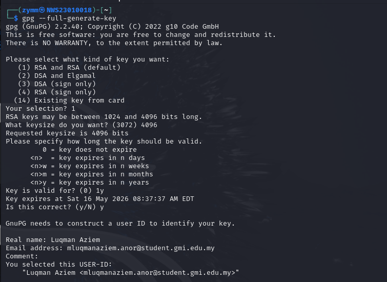

- GPG fingerprint is shown via `gpg --list-keys`
  
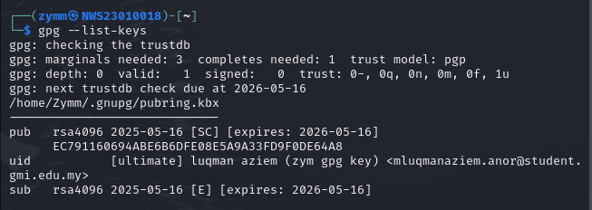

<br><br>

---
---

## 🗂️ Task 2: Encrypt and Decrypt a File

- **File Created:** `myfault.txt`
- **Content:**
  `This file was encrypted by Luqman Aziem (NWS23010018)`

**Commands Used:**

```bash
gpg -e -r "Luqman Aziem" myfault.txt
gpg -d myfault.txt.gpg
```

All the output:

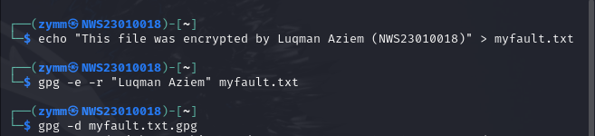

The requirements of Passphrase

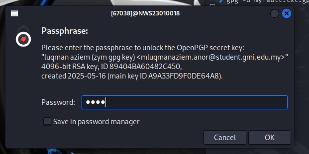

The decrypted file:

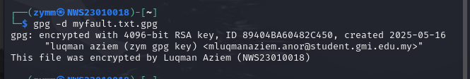

- ✅ Successfully decrypted and verified the contents.

<br><br>

---
---

## ✍️ Task 3: Sign and Verify a Message

**Signed Message:**
`I, Luqman Aziem, declare this is my work.`

**Commands Used:**

```bash
gpg --clearsign signed_message.txt
gpg --verify signed_message.txt.asc
```

All the output:

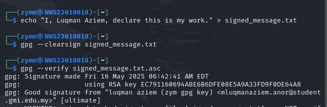

- ✅ Signature verified using GPG.

<br><br>

---
---

## 🔑 Task 4: Passwordless SSH Authentication

**Steps Completed:**

1. Generated SSH key:

   ```bash
   ssh-keygen -C "Luqman Aziem -NWS23010018"
   ```

   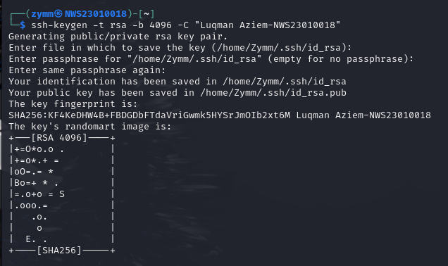

   <br>

   ---

2. Copied public key to target (localhost or test VM):

   ```bash
   ssh-copy-id Administrator@192.168.204.151
   ```

   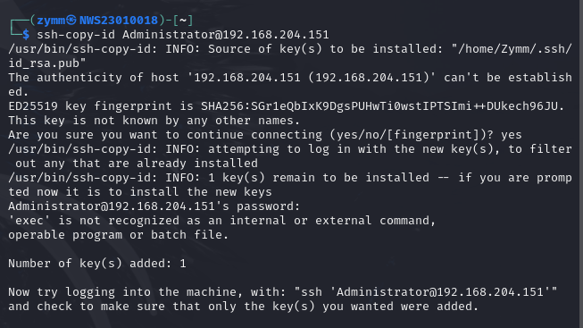

   <br>

   ---

3. Verified passwordless login:

   ```bash
   ssh user@remote "echo NWS23010018 > Luqman_Aziem.txt"
   ssh user@remote "whoami"
   ```

   Logging in without password:
   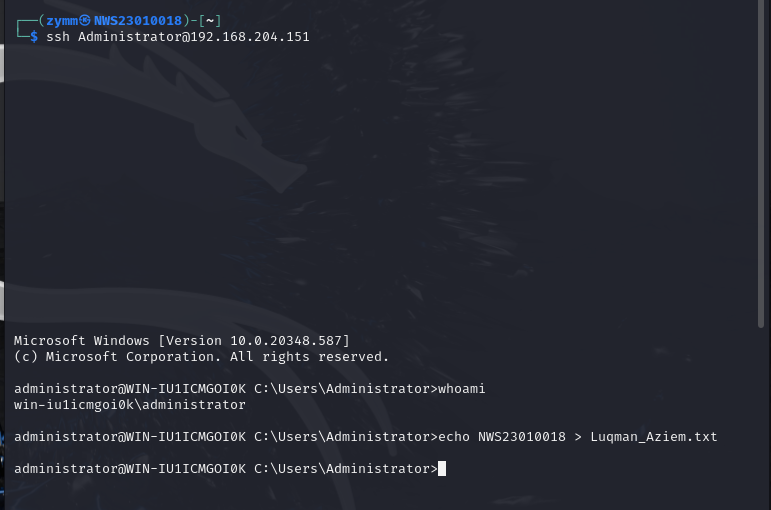

   The location of the file that was generated
   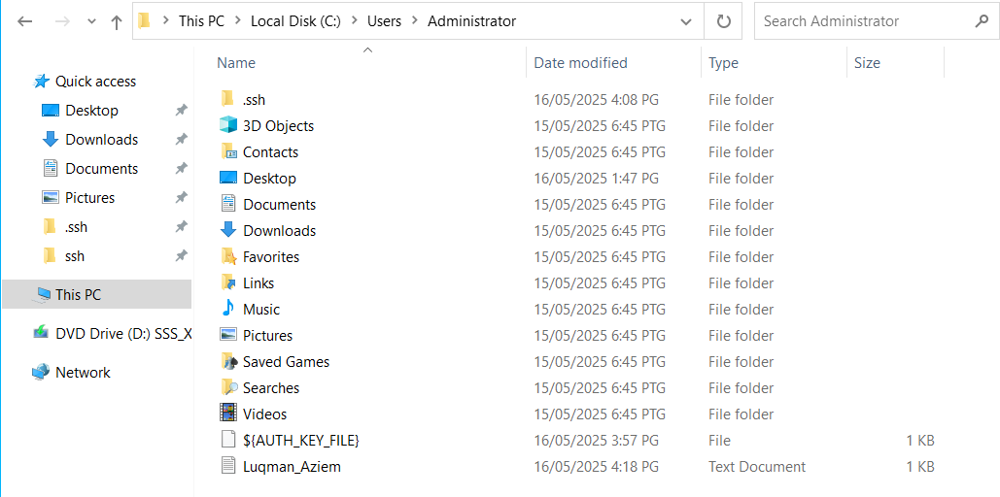

   Contents of the file:
   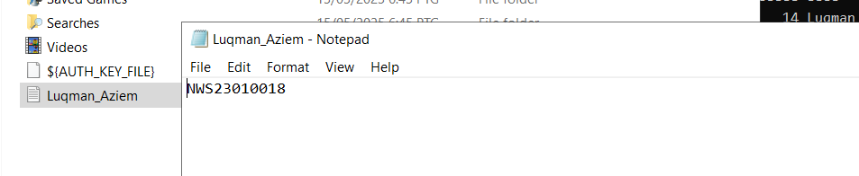

<br><br>

---
---

## 🧠 Task 5: Hash Cracking Challenge

**Hashes Provided:**

- Tools Used: `hashid`, `john`, `Cyberchef`
- Wordlist: `p1wordlist.txt` (custom list)

```bash
Bismillah
Assalamualaikum Semua
Apa Khabar Semuanya
Semoga Dalam Keadaan Sihat Hendaknya
Senang Je Soalan Ni Kaan
Tapi Kalau Susah
Begitulah Lumrah Kehidupan
Ada Yang Senaang
Ada Yang Susaaah
Apa2 Pun
Semoga Berjaya Semuanya
Alhamdulillah
Teruskan Usaha
Jangan Mudah Putus Asa
Setiap Cabaran Pasti Ada Hikmah
Percaya Diri Sendiri
Kejayaan Milik Yang Berusaha
Semoga Hari Ini
Lebih Baik Dari Semalam
InsyaAllah
```

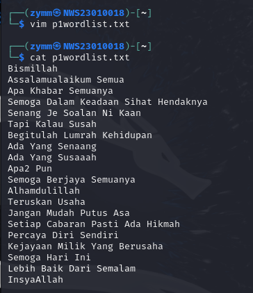

<br>

---

## Creating the hash file

```bash
echo <hash> > hash<n>.txt
```

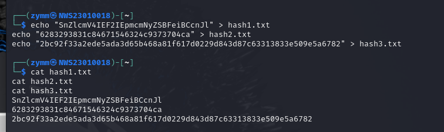

<br>

---

## Hash 1

Using CyberChef to change it from Base64 to Caesar Cipher:

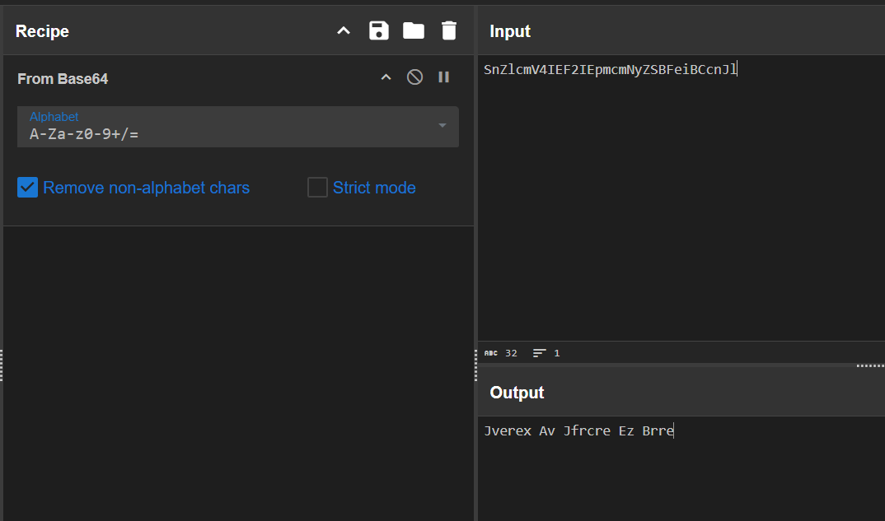

Using Caesar Cipher Decoder to decrypt the cipher:

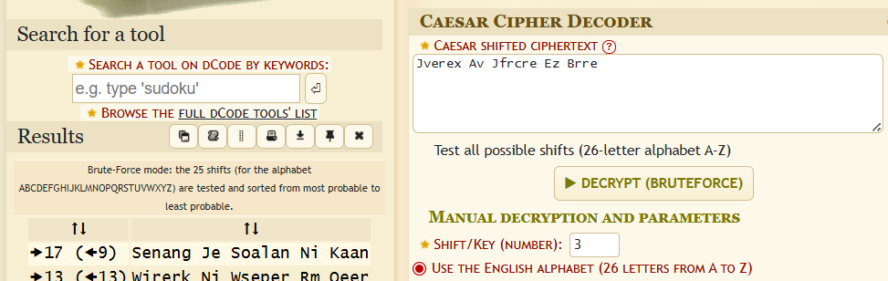

The message was: `Senang Je Soalan Ni Kaan`

<br>

---

## Hash 2

Identify the hash used:

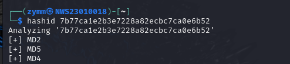

Cracking the hash with the wordlist `p1wordlist.txt`

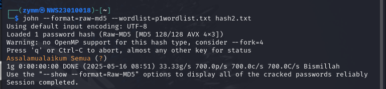

The message was: `Assalamualaikum Semua`

<br>

---

## Hash 3

Identify the hash used:

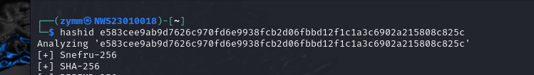

Cracking the hash with the wordlist `p1wordlist.txt`

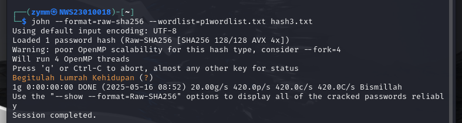

The message was: `Begitulah Lumrah Kehidupan`

<br>

---

## Summary

| Hash                                                               | Likely Type | Cracked? | Plaintext                              |   Method          |
| ------------------------------------------------------------------ | ----------- | -------- | ---------------------------------------| ---------------   |
| `SnZlcmV4IEF2IEpmcmNyZSBFeiBCcnJl`                                 | Base64 + Caesar Cipher    | ✅       | Senang Je Soalan Ni Kaan               | Manual decoding   |
| `7b77ca1e2b3e7228a82ecbc7ca0e6b52`                                 | MD5         | ✅       | Assalamualaikum Semua                  | John              |
| `e583cee9ab9d7626c970fd6e9938fcb2d06fbbd12f1c1a3c6902a215808c825c` | SHA-256     | ✅       | Begitulah Lumrah Kehidupan             | John              |

---
