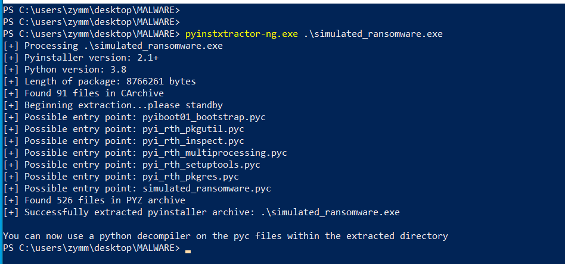

# 🔐 Cryptography - Malware Analysis

Hello and Assalamualaikum!

👾*Zymm*👾 is Back,

And for this new project:

The goal was to reverse a binary file (simulated ransomware) to recover its encrypted contents using decompilation and analysis techniques.

Imma provide ya fellas with the things you need and steps by steps for easir walkthrough but, before that, we need to do some prequisite

Well we need to be ready to create a masterpiece, am i right?

⚠️ WARNING ⚠️

PLEASE REMEMBER AND TAKE NOTE THAT THIS PROJECT WAS RUN AND DID INSIDE A SAFE SPACE OF VIRTUAL MACHINE

DO NOT ATTEMPT ON YOUR HOST DEVICE WHEN HADNDLING MALICIOUS FILES AND MALWARES

---

## 🧪 Objective

Ok so the main target for us is to decrypt the file of the malware and retrieve the original file contents, this gonna involve some analysis and understanding its behavior, sounds hard? dont worry, it is 🤣

---

## 🧰 Pre requisite / Tools Used

Here are some of the utensils that we gonna use to eat this malware up

- [DIE (Detect It Easy)](https://github.com/horsicq/DIE-engine/releases) – we gonna use this to analyze the file
  
- [pyinstxtractor-ng](https://github.com/pyinstxtractor/pyinstxtractor-ng) – we gonna reverse it from executable(`.exe`) to .pyc etc.

- [uncompyle6](https://pypi.org/project/uncompyle6/) – to decompile `.pyc` to `.py` This is where the fun starts, or hell some might say 😈

Wanna install? Use this:

```powershell
pip install uncompyle6
```

- `Python 3.8` - Why py 3.8? yeah because higher than this wont support the `uncompyle6` the we're gonna use
  
- PowerShell / Terminal
  
- (Optional) 7-Zip, Git, file explorer tools - Why optional? well its up to you if you wanna use this, but its gonna be **A LOT** and i mean **A WHOLE LOT** easier having this with ya

## Additional Steps For Setting Up Your Tools

This is an optional step that you can chosse either you want to do it or not, but i insist doing this because it will make your usage of the tool easier, so whats the harm i doing so right? C'mon lets do it

Ok so first off this is only for the `umcompyle6` , `PyInstaller` and `PyInstxtractor-ng` (i hate this name, its hard to remember and say🤣)

after installing both of em using this command

```powershell
pip install uncompyle6

pip install pyinstxtractor-ng

pip show PyInstaller
```

Use this command to see where was it installed files is, this will *Show You The Way*, exacly, the path

```powershell
pip show uncompyle6

pip show pyinstxtractor-ng

pip show PyInstaller
```

And you will see an output like this or maybe close to this, this is mine, so dont worry if its slightly different

- `uncompyle6`

```powershell
PS C:\Users\zymm> pip show uncompyle6
Name: uncompyle6
Version: 3.9.2
Summary: Python cross-version byte-code library and disassembler
Home-page: None
Author: None
Author-email: Rocky Bernstein <rb@dustyfeet.com>
License: GPL
Location: c:\users\zymm\appdata\local\programs\python\python38\lib\site-packages
Requires: spark-parser, click, xdis
Required-by:
PS C:\Users\zymm>
```

- `PyInstaller`
  
```powershell
Name: pyinstaller
Version: 6.13.0
Summary: PyInstaller bundles a Python application and all its dependencies into a single package.
Home-page: https://www.pyinstaller.org/
Author: Hartmut Goebel, Giovanni Bajo, David Vierra, David Cortesi, Martin Zibricky
Author-email: None
License: GPLv2-or-later with a special exception which allows to use PyInstaller to build and distribute non-free programs (including commercial ones)
Location: c:\users\zymm\appdata\local\programs\python\python38\lib\site-packages
Requires: altgraph, pyinstaller-hooks-contrib, pefile, packaging, setuptools, importlib-metadata, pywin32-ctypes
Required-by:
PS C:\users\zymm\desktop\MALWARE>
```

And this

- `pyinstxtractor-ng`

```powershell
PS C:\Users\zymm> pip show pyinstxtractor-ng
Name: pyinstxtractor-ng
Version: 2025.1.6
Summary: PyInstaller Extractor Next Generation
Home-page: None
Author: extremecoders-re
Author-email: None
License: GPL-3.0-only
Location: c:\users\zymm\appdata\local\programs\python\python38\lib\site-packages
Requires: xdis, pycryptodome
Required-by:
PS C:\Users\zymm>
```

You can see **A WHOLE LOT** of information about the tools, this will come in handy for other purposes

---

Next open up you search bar, and search `Environment Variables` and open it

After that, try finding `User Variable` find `Path` and click Edit, click new to add a new path, and paste the path for the `uncompyle6` and `PyInstxtractor-ng`, and finally click `OK` to save,

This will allow you to run both of em from anywhere premenatly, just be sure to get the path right, because we want *Jalan yang Lurus dan Benar* 🤣

So heres quick n' easy to follow (with some pic for easier navigation):

- Search Enviroment Variable


- Select Enviroment Variable


- Select User Variable


- Paste path


- OK to save

So after you're done with the paths, you will be able to run the executeables (`.exe`) from anywhere in your terminal,

SEE! EASIER! no need for path, but im not saying paths is not important, well you do you

---

## 📁 Given File

This is the main star of our project, (Drum Rolls please)

The malicious file that we gonna be Reverse engineer of

- Suspected ransomware executable : `simulated_ransomware.7z`
- Password : semogaberjaya
- Hash : 29cde12c20b7e712a4a412487157f9e46de46455da3d136ad84e41c479ac7c31

- Lets verify the malware first to avoid tempering:

    

- The malware file was verified successfully
- This is to make sure the file is indeed the one we gonna use and will act as wanted and avoid excessive damage

---

⚠️ WARNING ⚠️

MAKE SURE TO CREATE A SNAPSHOT OF YOUR VIRTUAL MACHINE BEFOR RUNNING THE MALWARE, SO WE CAN REVERT AFTER BEING INFECTED

- If we run the extracted file (using 7z), We can see that it will create a new folder named `locked_files`

    

- Heres the content of the folder

    

After observing the behavior of the Malware after we execute/run it, You can use the snapshot to revert to the previously uninfected state.

Why? *Better safe than sorry*

---

## 🧭 いくぞ Blasting Off With Step-by-Step

## 1. 🕵️ Identify the Binary

Ok so first off, we're gonna be using DIE, not death, `DIE (Detect It Easy)`, a bit exssive for a name eh? my thoughts too actually

This will show you a brief info on the files or malware that you will be investigating

- You can choose the file
- Drag n' Drop


You gonna see things like what language it use, what was it packed with etc.

We can see that it uses `Python` language, The tool used was `Visual Code` and was packed using `PyInstaller`

---

## 2. 📦 Extract Contents from .EXE

### Run pyinstxtractor-ng

Ok now we gonna use `pyinstxtractor` to reverese it packaging.

Why? because after finding out the language it used, we're gonna need to find the pure coding file for reverse engineering

```powershell
pyinstxtractor-ng.exe <filename>
```



```powershell
PS C:\users\zymm\desktop\MALWARE>
PS C:\users\zymm\desktop\MALWARE>
PS C:\users\zymm\desktop\MALWARE> pyinstxtractor-ng.exe .\simulated_ransomware.exe
[+] Processing .\simulated_ransomware.exe
[+] Pyinstaller version: 2.1+
[+] Python version: 3.8
[+] Length of package: 8766261 bytes
[+] Found 91 files in CArchive
[+] Beginning extraction...please standby
[+] Possible entry point: pyiboot01_bootstrap.pyc
[+] Possible entry point: pyi_rth_pkgutil.pyc
[+] Possible entry point: pyi_rth_inspect.pyc
[+] Possible entry point: pyi_rth_multiprocessing.pyc
[+] Possible entry point: pyi_rth_setuptools.pyc
[+] Possible entry point: pyi_rth_pkgres.pyc
[+] Possible entry point: simulated_ransomware.pyc
[+] Found 526 files in PYZ archive
[+] Successfully extracted pyinstaller archive: .\simulated_ransomware.exe

You can now use a python decompiler on the pyc files within the extracted directory
PS C:\users\zymm\desktop\MALWARE>
```

After running this command in your terminal, you can find that from the extension of `.exe.` you gonna find another with the extension of `.pyc`

or even  a new folder like example.exe_extracted/ with some .pyc files inside. Well anywhich ones works fine 😉

Lets see all of the extracted data that we got after the extraction


```powershell
PS C:\users\zymm\desktop\MALWARE\simulated_ransomware.exe_extracted> ls


    Directory: C:\users\zymm\desktop\MALWARE\simulated_ransomware.exe_extracted


Mode                 LastWriteTime         Length Name
----                 -------------         ------ ----
d-----         24/5/2025  11:20 AM                Crypto
d-----         24/5/2025  11:20 AM                importlib_metadata-8.5.0.dist-info
d-----         24/5/2025  11:20 AM                PYZ.pyz_extracted
d-----         24/5/2025  11:20 AM                setuptools
-a----         24/5/2025  11:20 AM         841697 base_library.zip
-a----         24/5/2025  11:20 AM        3381792 libcrypto-1_1.dll
-a----         24/5/2025  11:20 AM          32792 libffi-7.dll
-a----         24/5/2025  11:20 AM         686112 libssl-1_1.dll
-a----         24/5/2025  11:20 AM         189512 pyexpat.pyd
-a----         24/5/2025  11:20 AM            875 pyiboot01_bootstrap.pyc
-a----         24/5/2025  11:20 AM           3015 pyimod01_archive.pyc
-a----         24/5/2025  11:20 AM          22889 pyimod02_importers.pyc
-a----         24/5/2025  11:20 AM           4019 pyimod03_ctypes.pyc
-a----         24/5/2025  11:20 AM           1100 pyimod04_pywin32.pyc
-a----         24/5/2025  11:20 AM           1584 pyi_rth_inspect.pyc
-a----         24/5/2025  11:20 AM           1122 pyi_rth_multiprocessing.pyc
-a----         24/5/2025  11:20 AM           4425 pyi_rth_pkgres.pyc
-a----         24/5/2025  11:20 AM            966 pyi_rth_pkgutil.pyc
-a----         24/5/2025  11:20 AM            779 pyi_rth_setuptools.pyc
-a----         24/5/2025  11:20 AM        4183112 python38.dll
-a----         24/5/2025  11:20 AM        2960275 PYZ.pyz
-a----         24/5/2025  11:20 AM          26696 select.pyd
-a----         24/5/2025  11:20 AM           1867 simulated_ransomware.pyc
-a----         24/5/2025  11:20 AM            311 struct.pyc
-a----         24/5/2025  11:20 AM        1096264 unicodedata.pyd
-a----         24/5/2025  11:20 AM          89752 VCRUNTIME140.dll
-a----         24/5/2025  11:20 AM          63560 _asyncio.pyd
-a----         24/5/2025  11:20 AM          84040 _bz2.pyd
-a----         24/5/2025  11:20 AM         177664 _cffi_backend.cp38-win_amd64.pyd
-a----         24/5/2025  11:20 AM         123464 _ctypes.pyd
-a----         24/5/2025  11:20 AM         267336 _decimal.pyd
-a----         24/5/2025  11:20 AM          45640 _hashlib.pyd
-a----         24/5/2025  11:20 AM         252488 _lzma.pyd
-a----         24/5/2025  11:20 AM          29256 _multiprocessing.pyd
-a----         24/5/2025  11:20 AM          45128 _overlapped.pyd
-a----         24/5/2025  11:20 AM          28232 _queue.pyd
-a----         24/5/2025  11:20 AM          78920 _socket.pyd
-a----         24/5/2025  11:20 AM         117832 _ssl.pyd


PS C:\users\zymm\desktop\MALWARE\simulated_ransomware.exe_extracted>
```

Now we're gonna focus on the `.pyc` file from now on


```powershell
PS C:\users\zymm\desktop\MALWARE\simulated_ransomware.exe_extracted> ls *.pyc


    Directory: C:\users\zymm\desktop\MALWARE\simulated_ransomware.exe_extracted


Mode                 LastWriteTime         Length Name
----                 -------------         ------ ----
-a----         24/5/2025  11:20 AM            875 pyiboot01_bootstrap.pyc
-a----         24/5/2025  11:20 AM           3015 pyimod01_archive.pyc
-a----         24/5/2025  11:20 AM          22889 pyimod02_importers.pyc
-a----         24/5/2025  11:20 AM           4019 pyimod03_ctypes.pyc
-a----         24/5/2025  11:20 AM           1100 pyimod04_pywin32.pyc
-a----         24/5/2025  11:20 AM           1584 pyi_rth_inspect.pyc
-a----         24/5/2025  11:20 AM           1122 pyi_rth_multiprocessing.pyc
-a----         24/5/2025  11:20 AM           4425 pyi_rth_pkgres.pyc
-a----         24/5/2025  11:20 AM            966 pyi_rth_pkgutil.pyc
-a----         24/5/2025  11:20 AM            779 pyi_rth_setuptools.pyc
-a----         24/5/2025  11:20 AM           1867 simulated_ransomware.pyc
-a----         24/5/2025  11:20 AM            311 struct.pyc


PS C:\users\zymm\desktop\MALWARE\simulated_ransomware.exe_extracted>
```

Lets round up until we get the only file that we want

```powershell
ls *simulated*
```


```powershell
PS C:\users\zymm\desktop\MALWARE\simulated_ransomware.exe_extracted> ls *simulated*


    Directory: C:\users\zymm\desktop\MALWARE\simulated_ransomware.exe_extracted


Mode                 LastWriteTime         Length Name
----                 -------------         ------ ----
-a----         24/5/2025  11:20 AM           1867 simulated_ransomware.pyc


PS C:\users\zymm\desktop\MALWARE\simulated_ransomware.exe_extracted>
```

Let's view what you can see from the file first by using `Get-Content`

```powershell
Get-Content <filename>
```


```powershell
PS C:\users\zymm\desktop\MALWARE\simulated_ransomware.exe_extracted> Get-Content .\simulated_ransomware.pyc
U

ã
@sÒdd☺lm☺Z☺☺dd☻l☻Z☻dd♥l♥m♦Z♦☺d♦Z♣d♣e♣›☻Z♠e♦e♠ ¡ƒ☺¡d☻d♠…☻↓Z     d„Z
d       d
„Z♂e♀d♂k☻rÎd♀Z
e☻j♫e
d
d♫☻☺d☼d►d◄g♥Z☼d↕d‼d¶g♥Z►e◄e☼e►ƒ☻D]>\☻Z↕Z‼e☻j¶ §e
e↕¡☻Z¶e▬e¶d§ƒ☻►Z↨e↨ ↑e‼¡☺☺W5QRXe♂e¶ƒ☺☺qŽd☻S)▬é)☺Ú♥AESN)☺Ú♠sha256Ú
RahsiaLagiÚ♣Bukané►c☺☻♥Cs"d☺t|ƒ☺d☺▬↑}☺|t☺|☺g☺ƒ☺|☺¶↨S)☻Nr♠)☻Ú♥lenÚ♣bytes)☻Ú♦dataÚpad_len©r♂ú↨simulated_ransomware.pyÚ♥pad▲s♦☺r
c☺♠     Cspt|d☺ƒ☻♫}☺|☺ ☺¡}☻W5QRXt☻|☻ƒ☺}♥t♥ ♦t♣t♥j♠¡☻}♦|♦ |♥¡☺}♣t|d☻↨d♥ƒ☻►}☺|☺|♣¡☺☺W5QRXt       
|¡☺☺dS)♦NÚ☻rbz♦.encÚ☻wb)♂Ú♦openÚ♦readr
r☻Ú♥newÚ♥KEYMODE_ECBÚencryptÚ♣writeÚ☻osÚ♠remove)♠filepathÚ☺fÚ   plaintextÚ♠paddedÚ♠cipherÚ
ciphertextr♂r♂r♀Ú♀encrypt_file"s►☺♀☺↕☺♫☺
☺►☺¶☺r▼__main__z
locked_files/T)☺exist_okz
maklumat1.txtz
maklumat2.txtz
maklumat3.txta↨☺Assalamualaikum semua, pelajar kursus Cryptography semester 5.
Keselamatan siber bergantung kepada kebijaksanaan anda dalam memahami kriptografi.
Gunakan ilmu ini untuk melindungi data, sistem, dan masa depan teknologi.
Jadilah perisai digital yang berintegriti dan berkemahiran.zßSetiap algoritma yang anda pelajari hari ini adalah benteng pertahanan esok.
Kuasa penyulitan (encryption) bukan hanya tentang kod, tetapi amanah dalam menjaga maklumat.
Teruskan usaha, dunia digital menanti kepakaran anda!zÀSemoga ilmu yang dipelajari menjadi manfaat kepada semua.
Gunakan kepakaran anda untuk kebaikan, bukan kemudaratan.
Semoga berjaya di dunia dan akhirat!

Adli, Lecturer Part Time, Feb-Mei 2025Ú☺w)↓Ú
Crypto.Cipherr☻r↨Úhashlibr♥Ú
KEY_SUFFIXÚKEY_STRÚ♠encodeÚ♠digestr‼r
r▼__name__Ú♠foldermakedirsÚ♀sample_filescontentsÚ♥zipÚ♦nameÚcontentÚ♦pathÚ♦joinr►r→r▬r♂r♂r♂r♀<module>▬s(♀☺♀☻♦☺
☺↑♦
☺♦☺♫☻
☻☻♣☻♦☻ö♦◄↕☺♫☺♀☺¶☺
PS C:\users\zymm\desktop\MALWARE\simulated_ransomware.exe_extracted>
```

Here you gonna see an alien language or we say the binary data or a garbled text

Easy to say a non readable

---

### Time to play with `uncompyle6`

Here we are, one more step to get what we need, lets proceed to use `uncompyle6` to decomplile the previous `.pyc` file into a `.py` file

Here's the command we're gonna use

```powershell
uncompyle6.exe -o . .\gmi2025.pyc
```

But for more info on `uncompyle6` You can use help

```powershell
uncompyle6.exe --help
```

now lets see the files that has been decompiled with `ls`


```powershell
PS C:\users\zymm\desktop\MALWARE\simulated_ransomware.exe_extracted> uncompyle6 -o . .\simulated_ransomware.pyc
.\simulated_ransomware.pyc --
# Successfully decompiled file
PS C:\users\zymm\desktop\MALWARE\simulated_ransomware.exe_extracted> ls *simulated_ransomware*


    Directory: C:\users\zymm\desktop\MALWARE\simulated_ransomware.exe_extracted


Mode                 LastWriteTime         Length Name
----                 -------------         ------ ----
-a----         24/5/2025  11:42 AM           1943 simulated_ransomware.py
-a----         24/5/2025  11:20 AM           1867 simulated_ransomware.pyc


PS C:\users\zymm\desktop\MALWARE\simulated_ransomware.exe_extracted>
```

You can see that theres another file of `simulated_ransomware` but with the extension of `.py`

Which means that we can open it using python on Visual Code Studio

---

### FBI OPEN UP

Now that we're able to obtain the pure `.py` code, lets open it up


```py
# uncompyle6 version 3.9.2
# Python bytecode version base 3.8.0 (3413)
# Decompiled from: Python 3.8.10 (tags/v3.8.10:3d8993a, May  3 2021, 11:48:03) [MSC v.1928 64 bit (AMD64)]
# Embedded file name: simulated_ransomware.py
from Crypto.Cipher import AES
import os
from hashlib import sha256
KEY_SUFFIX = "RahsiaLagi"
KEY_STR = f"Bukan{KEY_SUFFIX}"
KEY = sha256(KEY_STR.encode()).digest()[None[:16]]

def pad(data):
    pad_len = 16 - len(data) % 16
    return data + bytes([pad_len]) * pad_len


def encrypt_file(filepath):
    with open(filepath, "rb") as f:
        plaintext = f.read()
    padded = pad(plaintext)
    cipher = AES.new(KEY, AES.MODE_ECB)
    ciphertext = cipher.encrypt(padded)
    with open(filepath + ".enc", "wb") as f:
        f.write(ciphertext)
    os.remove(filepath)


if __name__ == "__main__":
    folder = "locked_files/"
    os.makedirs(folder, exist_ok=True)
    sample_files = [
     "maklumat1.txt", "maklumat2.txt", "maklumat3.txt"]
    contents = [
     "Assalamualaikum semua, pelajar kursus Cryptography semester 5.\nKeselamatan siber bergantung kepada kebijaksanaan anda dalam memahami kriptografi.\nGunakan ilmu ini untuk melindungi data, sistem, dan masa depan teknologi.\nJadilah perisai digital yang berintegriti dan berkemahiran.",
     "Setiap algoritma yang anda pelajari hari ini adalah benteng pertahanan esok.\nKuasa penyulitan (encryption) bukan hanya tentang kod, tetapi amanah dalam menjaga maklumat.\nTeruskan usaha, dunia digital menanti kepakaran anda!",
     "Semoga ilmu yang dipelajari menjadi manfaat kepada semua.\nGunakan kepakaran anda untuk kebaikan, bukan kemudaratan.\nSemoga berjaya di dunia dan akhirat!\n\nAdli, Lecturer Part Time, Feb-Mei 2025"]
    for name, content in zip(sample_files, contents):
        path = os.path.join(folder, name)
        with open(path, "w") as f:
            f.write(content)
        encrypt_file(path)

```

Here you can see that the we can view the pure source code of the malware

We can now start analyzing the code for info

---

## 3. NOW THE REAL GAME BEGINS

Now that we have the file and its content, lets see if we can find some info by analyzing the content,

Lets lookout for thing like

- Keys (Public,Private) Format / Asymmetric or Symmetric
- The codes
- Links
- Files
- Names
- Hash / Encryption Format
- Functions


From the code, we managed to gain more info on this malware

Imma list it out for you if you dont get it:

- The Algorythim - AES, Why? cause we got library import of 

    ```py
    from Crypto.Cipher import AES
    ```

- Next up is The Mode: which we can see it ECB

    ```py
    cipher = AES.new(KEY, AES.MODE_ECB)
    ```

- Key Derivation, What is this u mean? Its a process of creating secret keys

    ```py
    KEY = sha256(b'BukanRahsiaLagi').digest()[:16]

    KEY_SUFFIX = "RahsiaLagi"
    KEY_STR = f"Bukan{KEY_SUFFIX}"
    KEY = sha256(KEY_STR.encode()).digest()[:16]
    ```

- We even got paddings, like shoulder pad, but this one we use to make sure our block is the right size, 
- its like how people hide they're short by using a thick shoes soles, no offense

    ```py
    pad_len = 16 - len(data) % 16
    return data + bytes([pad_len]) * pad_len
    ```

- Next u, this is the one that we see after running the Malware, you know, the *.enc files?
- Yeah here we can see that the files is created under the folder of locked_files, and if it doesnt exist, it will make a new directory to make sure it exist

    ```py
    folder = "locked_files/"
    os.makedirs(folder, exist_ok=True)
    and written with:
    with open(filepath + ".enc", "wb")
    ```

Okayyy ٱلْحَمْدُ لِلَّٰهِ (Alhamdulillah), Now we're done with that, we can see that it uses ECB, you can search info on it, mostly says that its `deterministic` which mean that it encrypt in the same ciphertext

For example if:

- aaa will be 111
- bbb will be 222
- ccc will be 333
- abc will be 123

See the pattern here? Yeah thats why its easy to notice

After gaining some info on our hands, its like obtaining the stones 🔴🔵🟢🟡🟣 for our [Infinity Gauntlet](https://en.wikipedia.org/wiki/The_Infinity_Gauntlet)

Thats how powerful information is,

*The Pen is mightier than The Sword* - Edward Bulwer-Lytton

But please dont bring a pen to a swordfight, theres a reason why is an `expression`

---

### 4. Becoming a Phantom Theif Lupin

### Figuring Out the Key

Seems like the files is encrypted, so lets see if we can crack it and steal its pearl (plaintext)

If i run the malware, it will create a locked file, like maklumat1.enc, so lets create a decryptor for it, abling us to open the file, or find the plaintext password

So let open with بسملة , (funnier in my head cause its and islamic version of Lupin 🤣)

So from all the information that we got, lets do the opposite, (funny how our parents used to tell us this and we will do the opposite too)

### The Structure of the Le Decryptor

lets name it `invader_zymm.py` , dont get the reference? its my childhood cartoon

Since we got the same name and both invading, why not, wanna know more? [Invader ZIM](https://en.wikipedia.org/wiki/Invader_Zim) p.s. *This is not an advertisment*

Lets do some planning like a real invader, MUAHAHAHA

- We gonna use the same Key Derivation to get the AES key - Why? Because its to get the exact derivation

- To decrypt, we're gonna use the same mode of ECB - Why? well to to enter and exit a house we're gonna need to use the same door right? same here:
  
  - Files were encrypted in AES ECB
  - lets decrypt with AES ECB

- The `invader_zymm.py` needs to be able to read and target the encrypted files 

- Removing the padding, because the padding add extras variable of character to fill in the gap, so removing it will give us the plaintext

- Finally SAVE, why? its to save, what more do you want? 🤣🤣

### THE RISE OF INVADER ZYMM

Finally after all the planning, we gonna create our weapon

Following the plans that was devised

Our decryptor- Sorry, our INVADER will be:

```py
from Crypto.Cipher import AES
from hashlib import sha256
import os

KEY_SUFFIX = "RahsiaLagi"
KEY_STR = f"Bukan{KEY_SUFFIX}"
KEY = sha256(KEY_STR.encode()).digest()[:16]

def unpad(data):
    pad_len = data[-1]
    if pad_len < 1 or pad_len > 16:
        raise ValueError("Invalid padding length")
    return data[:-pad_len]

def decrypt_file(enc_filepath, output_folder):
    with open(enc_filepath, "rb") as f:
        ciphertext = f.read()

    cipher = AES.new(KEY, AES.MODE_ECB)
    padded_plaintext = cipher.decrypt(ciphertext)
    plaintext = unpad(padded_plaintext)

    os.makedirs(output_folder, exist_ok=True)

    # Remove .enc and add .txt
    base_name = os.path.basename(enc_filepath)
    name_without_ext = base_name.replace(".enc", "")
    new_filename = f"{name_without_ext}.txt"
    dec_filepath = os.path.join(output_folder, new_filename)

    with open(dec_filepath, "wb") as f:
        f.write(plaintext)

    print(f"Decrypted: {enc_filepath} -> {dec_filepath}")

if __name__ == "__main__":
    locked_folder = "locked_files/"
    invaded_folder = "invaded_files/"

    for filename in os.listdir(locked_folder):
        if filename.endswith(".enc"):
            decrypt_file(os.path.join(locked_folder, filename), invaded_folder)

```

NOWWW, We're Ready to invade and reclaim those files! 🔥

How our `invader_zymm.py` will invade the files:

- its gonna look for *.enc files in the locked_files(folder that was created after running the malware)

- and then after running the script,
  
  ```powershell
    python invader_zymm.py
  ```

- it will create a new folder named invaded_files with the decrypted/invaded files in it

### Additonal Invade Tactics

- Heres another way to make it easier to invade, which is changing the `invader_zymm.py` ---> `invader_zymm.exe`

- How?
  - We already got and installed PyInstaller, so why no make use of it?

- Converting the script from `.py` to `.exe`
  
    ```powershell
    pyinstaller --onefile invader_zymm.py
    ```

- This is gonna cram everything into a single .exe file

    ```powershell
    PS C:\users\zymm\desktop\MALWARE>
    PS C:\users\zymm\desktop\MALWARE> pyinstaller --onefile invader_zymm.py
    874 INFO: PyInstaller: 6.13.0, contrib hooks: 2025.4
    874 INFO: Python: 3.8.10
    922 INFO: Platform: Windows-10-10.0.19045-SP0
    922 INFO: Python environment: c:\users\zymm\appdata\local\programs\python\python38
    922 INFO: wrote C:\users\zymm\desktop\MALWARE\invader_zymm.spec
    937 INFO: Module search paths (PYTHONPATH):
    ['C:\\Users\\zymm\\AppData\\Local\\Programs\\Python\\Python38\\Scripts\\pyinstaller.exe',
    'c:\\users\\zymm\\appdata\\local\\programs\\python\\python38\\python38.zip',
    'c:\\users\\zymm\\appdata\\local\\programs\\python\\python38\\DLLs',
    'c:\\users\\zymm\\appdata\\local\\programs\\python\\python38\\lib',
    'c:\\users\\zymm\\appdata\\local\\programs\\python\\python38',
    'c:\\users\\zymm\\appdata\\local\\programs\\python\\python38\\lib\\site-packages',
    'C:\\users\\zymm\\desktop\\MALWARE']
    2437 INFO: checking Analysis
    2437 INFO: Building Analysis because Analysis-00.toc is non existent
    2437 INFO: Running Analysis Analysis-00.toc
    2437 INFO: Target bytecode optimization level: 0
    2437 INFO: Initializing module dependency graph...
    2453 INFO: Initializing module graph hook caches...
    2531 INFO: Analyzing modules for base_library.zip ...
    4827 INFO: Processing standard module hook 'hook-heapq.py' from 'c:\\users\\zymm\\appdata\\local\\programs\\python\\python38\\lib\\site-packages\\PyInstaller\\hooks'
    6296 INFO: Processing standard module hook 'hook-encodings.py' from 'c:\\users\\zymm\\appdata\\local\\programs\\python\\python38\\lib\\site-packages\\PyInstaller\\hooks'
    10874 INFO: Processing standard module hook 'hook-pickle.py' from 'c:\\users\\zymm\\appdata\\local\\programs\\python\\python38\\lib\\site-packages\\PyInstaller\\hooks'
    13874 INFO: Caching module dependency graph...
    14186 INFO: Looking for Python shared library...
    14202 INFO: Using Python shared library: c:\users\zymm\appdata\local\programs\python\python38\python38.dll
    14218 INFO: Analyzing C:\users\zymm\desktop\MALWARE\invader_zymm.py
    14234 INFO: Processing standard module hook 'hook-Crypto.py' from 'c:\\users\\zymm\\appdata\\local\\programs\\python\\python38\\lib\\site-packages\\_pyinstaller_hooks_contrib\\stdhooks'
    15937 INFO: Processing standard module hook 'hook-platform.py' from 'c:\\users\\zymm\\appdata\\local\\programs\\python\\python38\\lib\\site-packages\\PyInstaller\\hooks'
    16593 INFO: Processing module hooks (post-graph stage)...
    16624 INFO: Performing binary vs. data reclassification (42 entries)
    16827 INFO: Looking for ctypes DLLs
    16843 INFO: Analyzing run-time hooks ...
    16859 INFO: Creating base_library.zip...
    17125 INFO: Looking for dynamic libraries
    17733 INFO: Extra DLL search directories (AddDllDirectory): []
    17733 INFO: Extra DLL search directories (PATH): []
    19171 INFO: Warnings written to C:\users\zymm\desktop\MALWARE\build\invader_zymm\warn-invader_zymm.txt
    19280 INFO: Graph cross-reference written to C:\users\zymm\desktop\MALWARE\build\invader_zymm\xref-invader_zymm.html
    19359 INFO: checking PYZ
    19359 INFO: Building PYZ because PYZ-00.toc is non existent
    19359 INFO: Building PYZ (ZlibArchive) C:\users\zymm\desktop\MALWARE\build\invader_zymm\PYZ-00.pyz
    20093 INFO: Building PYZ (ZlibArchive) C:\users\zymm\desktop\MALWARE\build\invader_zymm\PYZ-00.pyz completed successfully.
    20186 INFO: checking PKG
    20186 INFO: Building PKG because PKG-00.toc is non existent
    20186 INFO: Building PKG (CArchive) invader_zymm.pkg
    26030 INFO: Building PKG (CArchive) invader_zymm.pkg completed successfully.
    26062 INFO: Bootloader c:\users\zymm\appdata\local\programs\python\python38\lib\site-packages\PyInstaller\bootloader\Windows-64bit-intel\run.exe
    26062 INFO: checking EXE
    26062 INFO: Building EXE because EXE-00.toc is non existent
    26062 INFO: Building EXE from EXE-00.toc
    26062 INFO: Copying bootloader EXE to C:\users\zymm\desktop\MALWARE\dist\invader_zymm.exe
    26111 INFO: Copying icon to EXE
    26140 INFO: Copying 0 resources to EXE
    26140 INFO: Embedding manifest in EXE
    26186 INFO: Appending PKG archive to EXE
    26249 INFO: Fixing EXE headers
    26734 INFO: Building EXE from EXE-00.toc completed successfully.
    26749 INFO: Build complete! The results are available in: C:\users\zymm\desktop\MALWARE\dist
    PS C:\users\zymm\desktop\MALWARE>
    ```

- after the process is done

    

You Can see that a new executeable has been made now lets try run it

⚠️ Keep in mind that the `invader_zymm.exe` need to be in the same folder or path with the encrypted file ⚠️


Finally you can see that the files that was encrypted before are now viewable and readable


### The Outcome of the WAR

To Enable the Invader we can run the script with 

```powershell
  python invader_zymm.py
```

Lets the spoils of war tha our Invader has brought us

```powershell
PS C:\users\zymm\desktop\MALWARE>
PS C:\users\zymm\desktop\MALWARE> python invader_zymm.py
Decrypted: locked_files/maklumat1.txt.enc -> invaded_files/maklumat1.txt
Decrypted: locked_files/maklumat2.txt.enc -> invaded_files/maklumat2.txt
Decrypted: locked_files/maklumat3.txt.enc -> invaded_files/maklumat3.txt
PS C:\users\zymm\desktop\MALWARE>
```


Lets see all the invaded files content:


- maklumat1.txt

    ```powershell
    Assalamualaikum semua, pelajar kursus Cryptography semester 5.
    Keselamatan siber bergantung kepada kebijaksanaan anda dalam memahami kriptografi.
    Gunakan ilmu ini untuk melindungi data, sistem, dan masa depan teknologi.
    Jadilah perisai digital yang berintegriti dan berkemahiran.
    ```

    

- maklumat2.txt

    ```powershell
    Setiap algoritma yang anda pelajari hari ini adalah benteng pertahanan esok.
    Kuasa penyulitan (encryption) bukan hanya tentang kod, tetapi amanah dalam menjaga maklumat.
    Teruskan usaha, dunia digital menanti kepakaran anda!
    ```

    

- maklumat3.txt

    ```powershell
    Semoga ilmu yang dipelajari menjadi manfaat kepada semua.
    Gunakan kepakaran anda untuk kebaikan, bukan kemudaratan.
    Semoga berjaya di dunia dan akhirat!

    Adli, Lecturer Part Time, Feb-Mei 2025
    ```

    

## Thats All for Me, Zymm, logging off, Assalamualaikum ٱلسَّلَامُ عَلَيْكُمْ